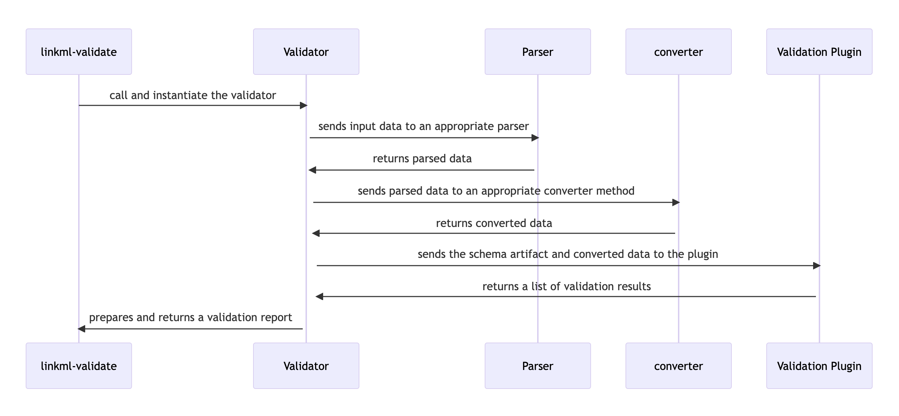

# Background

[LinkML](https://linkml.io) (Moxon et al.) is a data modeling language that can be used to describe the structure and semantics of data from a specific domain. LinkML lets you manage various levels of semantic expressivity, depending on the use-case at hand. As a result, data models expressed in LinkML can be utilized with various (relational and non-relational) data stores.

There are two parts to the LinkML ecosystem:
- **the modeling language:** a vocabulary that can be used to define data models
- **the tooling:** a suite of tools for generating technology-specific artifacts from data models

As with any data ecosystem, there is also a need for tools that support validation of data. Currently, the LinkML ecosystem provides a simple validation utility that can be used to validate data against a LinkML schema. But this validation utility makes use of JSON Schema for performing validation. While this does cover several validation use-cases, it is still limited in its applicability and scope. Thus, there is a need for a data validation utility that is flexible and can grow organically according to use-cases.

The goal of this project was to improve on LinkML's validation framework by adopting certain design principles:

1. **Schema Agnostic:** The validator must be schema agnostic and must not make any assumptions on the incoming data outside of the scope of LinkML metamodel (i.e. the validator should run for any given LinkML schema)
2. **Plugin Architecture:** Each type of validation should be its own plugin. This ensures that validation scenarios are atomic, well documented, and can be configured for appropriate use-cases. Plugins can be internal or external, with both types supported
3. **Extendable Parsers**: The validator should be able parse various types of data formats (and data stores) and should be configurable such that the choice of the validator is left to the user with sensible defaults applied where required
4. **Easy to Configure:** The plugins, and by extension, the validator should be configurable at runtime such that the plugin and validator behavior can be tweaked for certain inputs or use-cases
5. **Parseable Validation Messages:** The validator should return validation results and reports that are concise, easy to parse, and conforms to a well defined structure. Since the validation framework is aware of the LinkML metamodel, it can also make use of the native LinkML validation schema to ensure that the structure of the validation reports are aligned and compatible with the LinkML ecosystem

Following the aforementioned design principles will ensure flexibility and sustainability of the validation tool. 

# Outcomes

## Redesign of the Validation

We approach the redesign of the existing LinkML validation tool by implementing the following components:
- Models
- Parsers
- Validation Plugins
- Validator

### Models

One of the key design principles was to have well structured and parseable validation messages. This is to ensure that the validation results provided by the validator can be acted upon by downstream tools. Thus, we define two classes for capturing the outcome of validation:

- `ValidationResult`: A Validation Result is an object that holds information about a validation error as reported by a validation plugin. A validation plugin may yield more than one Validation Result, depending on the severity of the error encountered during validation.
- `ValidationReport`: A Validation Report is an object that holds information about all validation errors (i.e. Validation Results) for a given object.

The `ValidationResult` and `ValidationReport` classes were adapted from the validation models defined in [linkml-runtime](https://github.com/linkml/linkml-runtime). As the redesign progresses, the classes will undergo modifications to better suit the use-cases. Eventually there will be a harmonization of model such that the validation models in linkml-runtime will be the same as the one used by the linkml validator.

### Parsers

Parsers are classes that can parse data from a given file format or a data store. They are an abstraction that enables fetching records defined in the file (or store). These parsers are defined such that they are capable of streaming records such that consumers of these parsers can iterate over a stream of records instead of handling the incoming data in bulk.

The parsers can optionally do some additional restructuring of the incoming data to make it better suited for validation by the validation plugins. This can be as a result of overcoming limitations with the underlying file format or data store.

### Validation Plugins

A Validation Plugin is a class that is responsible for accepting records as input and performing a set of operations on the input. The validation plugin is aware of the provided schema and is responsible for generating the artifacts that it needs for performing validation.

There is a base class called `BasePlugin` which defines a collection of abstract methods that all subclasses must implement. This is to ensure that the methods for all plugins are consistent and behave the same way.

Validation Plugins are responsible for returning one or more instances of Validation Result where each instance is describing an error encountered during validation in sufficient detail. The plugins should, if possible, report the context where the error was found via the Validation Result.

Validation Plugins can be internal or external. Internal validation plugins are the ones defined in the linkml repository where as external validation plugins are the custom validation plugins defined by a user for their validation needs.

### Validator

The Validator class is the common interface for invoking the validation of a given input data against a given input schema. The class defines two methods that are exposed via the CLI:

- `validate`: Given an object, a schema YAML, and a set of validation plugins - validate the object against the given schema by running each validation plugin on the data object and return a Validation Report for the object.
- `validate_file`: Given a file (that contains one or more objects), a schema YAML, and a set of validation plugins - validate all objects against the given schema by running each validation plugin on the objects and returning a Validation Report for each object from the file.

There can be additional methods in the Validator class but these may or may not be apparent or exposed via the CLI.

The Validator class defines a set of default plugins for various input formats to make it easy for users to use the Validator. But these defaults can be modified at runtime.

# Future work

The work described in this report is a start to the redesign of the linkml validation tool. As a first pass, the design highlighted above yields good promising outcomes and provides a foundation to build a flexible and configurable validation framework in linkml.

Moving forward we would like to achieve the following:

- **Add support for commonly requested input formats:** This ensures that commonly encountered use-cases are supported via the CLI and sufficient examples are provided via documentation
- **Add support for commonly used validation scenarios:** This ensures that commonly used validation scenarios are supported via the CLI and sufficient examples are provided via documentation
- **Finalize and document the flexible aspects of the validator:** This ensures that the user is aware of the various ways they can tweak and configure the new validation tool such that they can accommodate their validation scenarios
- **Define a common API specification to invoke the validator:** This ensures that other tools, like the new shex-rs validator, can follow the same API specification and thus provide a common interface for users
- **Focus on scalability:** This ensures that the validation can be performed on large input data in a scalable manner

# Discussion

A flexible framework for performing validation of data against any given LinkML-based schema can have a positive impact on the LinkML community. New (and existing users) can adopt the validation framework and extend it for their needs to ensure data quality, data consistency, and also perform checks that may not be possible (or easy) in the context of Pydantic, JSONSchema, or Shape Expressions. The work highlighted can serve as a useful utility for data integration and validation pipelines that need a reliable way to identify data inconsistencies and report them in a way that is actionable. The work outlined is an addition to the rapidly developing LinkML ecosystem and collectively aims to make schema representation, data representation, and data harmonization easier and manageable - especially in the context of biological and biomedical data.

## Acknowledgements

We would like to thank the fellow participants at BioHackathon 2023 for their collaboration and constructive advice, which greatly influenced our project. We are grateful to the organizers for providing this platform and the developers of open source language models. We are also grateful to the LinkML developers - especially Patrick Kalita - and the wider community for being active, engaged, and constructive with their requirements and feedback.

## References

1. Moxon, S., Solbrig, H., Unni, D., Jiao, D., Bruskiewich, R., Balhoff, J., Vaidya, G., Duncan, W., Hegde, H., Miller, M., Brush, M., Harris, N., Haendel, M., & Mungall, C. (2021). The Linked Data Modeling Language (LinkML): A General-Purpose Data Modeling Framework Grounded in Machine-Readable Semantics. CEUR Workshop Proceedings, 3073, 148-151.
